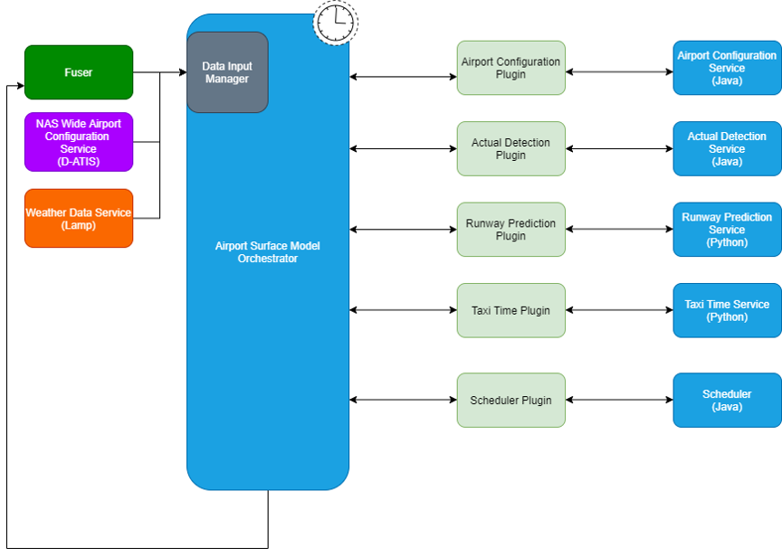
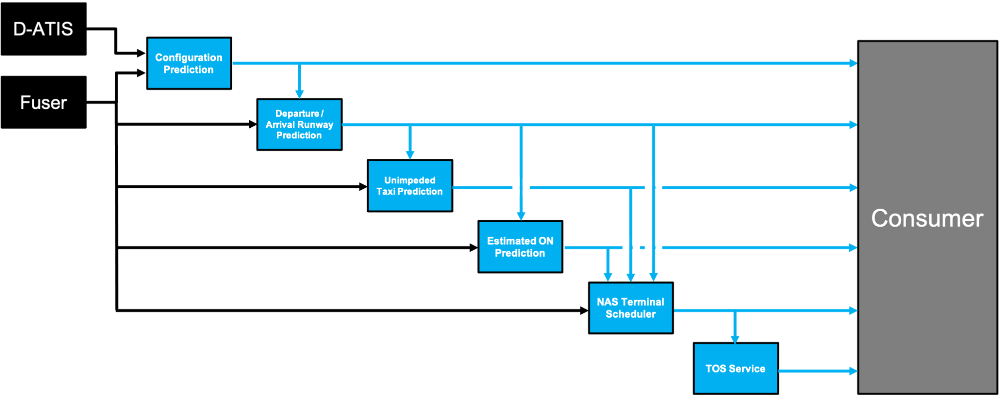

## Taxi-Out Time Duration Prediction

The ML-airport-taxi-out software is developed to provide a reference implementation to serve as a research example how to train and register Machine Learning (ML) models intended for predicting impeded and unimpeded taxi out duration. The software is designed to point to databases which are not provided as part of the software release and thus this software is only intended to serve as an example of best practices. The software is built in python and leverages open-source libraries kedro, scikitlearn, MLFlow, and others. The software provides examples how to build three distinct pipelines for data query and save, data engineering, and data science for each model. These pipelines enable scalable, repeatable, and maintainable development of ML models.

## ML Airport Surface Model Background Information

The ML-airport-taxi-out models are one of several ML models tied together by the Airport Surface Model Orchestrator shown below.

 

The Airport Surface Model Orchestrator runs at fixed intervals and is driven from real-time Fused FAA System Wide Information Management (SWIM) data feeds and also pulls in additional D-ATIS airport configuration data and weather data. The data input manager within the Orchestrator prepares data for each ML service and data is exchanged between the Orchestrator and the ML services via API interfaces.

The input data sources for the individual ML prediction services are shown in the below diagram which also illustrates dependencies between the individual ML services.



The ML Airport Surface Model forms the building blocks of a cloud based predictive engine that alerts flight operators to pre-departure Trajectory Option Set (TOS) reroute opportunities within the terminal airspace. The ML Airport Surface Model was designed to be a scalable replacement for the capabilities provided by NASA's Surface Trajectory Based Operations (STBO) subsystem, which is a component of the fielded ATD2 Phase 3 System in the North Texas Metroplex. The STBO subsystem relies heavily upon detailed adaptation, which defines the physical constraints and encodes Subject Matter Expert knowledge within decision trees, and creates a costly bottleneck to scaling the pre-departure TOS digital reroute capability across the National Airspace System.


## Taxi-out Prediction Models

This project trains and evaluates models that predict taxi-out durations.
There are six types of models that can be trained for an airport.
These predict :
- unimpeded AMA taxi-out time
- unimpeded ramp taxi-out time
- unimpeded full taxi-out time (AMA + ramp taxi)
- impeded AMA taxi-out time
- impeded ramp taxi-out time
- impeded full taxi-out time (AMA + ramp taxi)

Unimpeded taxi-out time predictions are not time-varying.
Impeded taxi-out time models are trained to make predictions prior to take-off.

## Steps to start using this project (and some helpful information about Kedro + MLflow projects)

In addition to the steps below, take a look at the [Kedro documentation](https://kedro.readthedocs.io) and the [MLflow documentation](https://mlflow.org/docs/latest/index.html) for more help getting started.

## Set up the project conda environment

Create new environment from `conda.yaml` file
```
conda env create -f conda.yaml
```
Then activate the environment.
```
conda activate taxi-out-env
```

## Configure Kedro

*Credentials*
credentials.yml defines username, host, port to access a database which we assume has FUSER data.
A Kedro `credentials.yml` file needs to be created in `conf/local/`.
An example of such a file is in `credentials-template.yml`.

*Per-airport Globals*

In this project, each model is trained for a particular airport.
The airport and potentially airport-specific items are specified in `conf/base/globals.yml` or `conf/base/<airport_icao>_globals.yml`, where `<airport_icao>` is the ICAO identifier for an airport (e.g., KCLT).
Which particular `globals.yml` is used is specified at run time as a parameter specified in the `kedro run` command line interfaces (described below) or the airport specific file can be copied into `globals.yml`.
This approach is based on [Kedro's templated configurations capability](https://kedro.readthedocs.io/en/stable/04_kedro_project_setup/02_configuration.html#templating-configuration).
Implementing it required us to overwrite the `_create_config_loader` method in `src/taxi_out/run.py` to use a [TemplatedConfigLoader](https://kedro.readthedocs.io/en/stable/kedro.config.TemplatedConfigLoader.html) in a way similar to what is described in the Kedro documentation, but extended to allow for the `global_config_yml` command line interface parameter.

If using Kedro's Jupyter notebook or IPython integrations, the overall `globals.yml` is always used (i.e., there is not currently any way to specify which airport-specific `<airport_icao>_globals.yml` to use when initiating the Jupyter notebook session).
The overall `globals.yml` can be updated during a Jupyter or IPython session (e.g., to specify a different airport) if, after changing the file, the `%reload_kedro` command is executed in the Jupyter notebook or IPython console session.
This will update the Kedro `context` variable to take into account the updated `globals.yml`.
See the "Working with Kedro from notebooks or IPython" section below and the [relevant Kedro documentation]
(https://kedro.readthedocs.io/en/stable/11_tools_integration/02_ipython.html) for additional information about Kedro's Jupyter and IPython capabilities.

*Parameters*

The `conf/base/parameters.yml` file contains any parameters that control various aspects of the pipelines that engineer data and train and test models. This file can be airport-specific as well, and in that case the ICAO identifier will prefix the file (`<airport_icao>_parameters.yml`).
The parameters file specifies, for instance, the type of maching learning model that should be used and what hyperparameters will control its training.
You may wish to update some of these parameters.
Items in `parameters.yml` that are surrounded by `${` and `}` will be imported from the `globals.yml`.
[Kedro's configuration templating documentation](https://kedro.readthedocs.io/en/stable/04_kedro_project_setup/02_configuration.html#template-configuration) provides additional information about templated configurations via `globals.yml`.

The MLflow parameters, formally set via environmental variables, are now contained in the `parameters.yml` file, and will be used to specify the experiment_name, tracking_uri, etc. Example below:
   ```
   unimp_ramp_model_params:
     name: unimp_ramp_GBR
     ...
   
     mlflow:
       tracking_uri:http://machine_name:port_number
       experiment_name:unimpeded_ramp_taxiout
   ```
   
   *Note:* If the experiment_name does not exist (e.g., there is no experiment_id within the mlflow server associated with the name), then a new experiment will be automatically created

*Data Catalog*

Any data sets used in this Kedro project must be declared in the `conf/base/catalog.yml` "data catalog."
There should not be any reason for you to update this data catalog, but it contains items surrounded by `${` and `}` that will be imported from the `globals.yml` specified for a particular run.
[Kedro's configuration templating documentation](https://kedro.readthedocs.io/en/stable/04_kedro_project_setup/02_configuration.html#template-configuration) provides additional information.

*Kedro Nodes & Pipelines*

[Kedro pipelines](https://kedro.readthedocs.io/en/stable/02_get_started/03_hello_kedro.html#pipeline) specify a directed acyclic graph of [Kedro nodes](https://kedro.readthedocs.io/en/stable/02_get_started/03_hello_kedro.html#node) to be run, with various data sets declared in the `catalog.yml` or parameters specified in `parameters.yml` serving as inputs.
Other than parameters or data sets declared in the data catalog, model inputs can be names of objects that are output from other nodes, such as intermediate data sets or trained models.
The overall project pipelines are defined in `src/taxi_out/pipeline.py`.
These are defined by combining partial pipelines defined in other places throughout the project.
For example, some data engineering pipelines are defined in `src/taxi_out/pipelines/data_engineering/pipeline.py`.
Nodes are simply wrappers around functions, which in turn can be defined or imported from anywhere, but are often and conventionally defined in various `nodes.py` files in various directories throughout the project.

## Configure MLflow

*MLflow server*

MLflow can be configured to track runs locally or remotely on a server.

*MLflow API*

Throughout the code are some [MLflow API](https://www.mlflow.org/docs/latest/python_api/index.html) calls.
These do things like log run parameters and metrics to the MLflow server or log run artifacts (e.g., pickled trained models) to the MLflow artifact store.

## Getting data with Data Query and Save (DQS) Pipeline

Most of the data required to run train models in this project can be acquired by running "data query and save" (DQS) pipelines.
These run some queries per data set declarations in `conf/base/catalog.yml` (with some aspects of these declarations imported from the specified `conf/base/*globals.yml`), accessing databases per credentials in `conf/local/credentials.yml`, and save resulting CSVs locally in the `data/` folder (typically in the `01_raw/` subfolder).
The CSV data set naming convention puts the relevant airport ICAO code as a prefix (e.g., if running with a `KJFK_globals.yml` for KJFK, then the data sets will be named things like `data/01_raw/KJFK.MFS_data_set.csv`).
Other data engineering or full pipelines start from those CSVs.
These commands do not need to be rerun over and over for the same airport and time period; once they are run once the data will be available in the CSVs in the `data/` folder.

Since the data query and save pipelines run queries that retrieve and then save to disk potentially large amounts of data, they can take tens of minutes to hours to run, depending in particular on the duration of time between `start_time` and `end_time` in `globals.yml`.
To track pipeline run progress during these potentially long runs, Kedro informational logging statements will be printed to the screen.

*Unimpeded/Impeded models*

To get the data needed to train an unimpeded ramp model, run the command below from the `taxi_out/` directory.
```
kedro run --pipeline dqs --params global_config_yml:<airport_icao>_globals.yml
```
or
```
cp ./conf/base/<airport_icao>_globals.yml ./conf/base/globals.yml
kedro run --pipeline dqs
```
The `<airport_icao>` must be replaced by the ICAO identifier. A few other data query pipelines are available, and are listed in the file `src/taxi_out/pipeline.py`.


## Training and testing models

After running the queries to get the required data sets, models can be trained and tested.

*Unimpeded ramp  model*

To train and test an unimpeded ramp model, run the commands below.
```
cp conf/base/<airport_icao>_globals.yml conf/base/globals.yml
cp conf/base/<airport_icao>_parameters.yml conf/base/parameters.yml
kedro run --pipeline unimp_ramp_taxi 
```

After training and testing a model, the run creating the model should be visible and available for review in the MLflow UI in the "unimpeded_ramp_taxiout" experiment.

*Unimpeded AMA models*

To train and test an unimpeded ama model, run the commands below.
```
cp conf/base/<airport_icao>_globals.yml conf/base/globals.yml
cp conf/base/<airport_icao>_parameters.yml conf/base/parameters.yml
kedro run --pipeline unimp_ama_taxi 
```

After training and testing a model, the run creating the model should be visible and available for review in the MLflow UI in the "unimpeded_ama_taxiout" experiment.

*Unimpeded full models*

To train and test an unimpeded ama model, run the commands below.
```
cp conf/base/<airport_icao>_globals.yml conf/base/globals.yml
cp conf/base/<airport_icao>_parameters.yml conf/base/parameters.yml
kedro run --pipeline unimp_full_taxi 
```

After training and testing a model, the run creating the model should be visible and available for review in the MLflow UI in the "unimpeded_full_taxiout" experiment.


*Impeded ramp models*

To train and test an impeded ramp model, run the commands below.
```
cp conf/base/<airport_icao>_globals.yml conf/base/globals.yml
cp conf/base/<airport_icao>_parameters.yml conf/base/parameters.yml
kedro run --pipeline imp_ramp_taxi 
```

After training and testing a model, the run creating the model should be visible and available for review in the MLflow UI in the "impeded_ramp_taxiout" experiment.

*Impeded AMA models*

To train and test an impeded AMA model, run the commands below.
```
cp conf/base/<airport_icao>_globals.yml conf/base/globals.yml
cp conf/base/<airport_icao>_parameters.yml conf/base/parameters.yml
kedro run --pipeline imp_ama_taxi 
```

After training and testing a model, the run creating the model should be visible and available for review in the MLflow UI in the "impeded_ama_taxiout" experiment.


*Impeded full models*

To train and test an impeded AMA model, run the commands below.
```
cp conf/base/<airport_icao>_globals.yml conf/base/globals.yml
cp conf/base/<airport_icao>_parameters.yml conf/base/parameters.yml
kedro run --pipeline imp_full_taxi 
```

After training and testing a model, the run creating the model should be visible and available for review in the MLflow UI in the "impeded_full_taxiout" experiment.


## Working with Kedro from notebooks or IPython

In order to use Jupyter notebooks or IPython in your Kedro project, you need to install Jupyter from within the project's conda environment:

```
conda install jupyter
```

For using Jupyter Lab, you need to install it:

```
conda install jupyterlab
```

After installing Jupyter and/or Jupyter Lab, you can start a local notebook server:

```
kedro jupyter notebook
```

You can also start Jupyter Lab:

```
kedro jupyter lab
```

And if you want to run an IPython session:

```
kedro ipython
```

Staring Jupyter or IPython this way executes a startup script in `.ipython/profile_default/startup/00-kedro-init.py`.
This creates a Kedro `context` variable in scope; the `context` can be used to access the data catalog, parameters, execute pipelines or portions thereof, and more.
See the [relevant Kedro documentation](https://kedro.readthedocs.io/en/stable/11_tools_integration/02_ipython.html)
for details.

In each of these cases, the session uses the global settings (e.g., airport ICAO) in `conf/base/globals.yml` to populate various items in `parameters.yml` and `catalog.yml`.
If you wish to adjust those global settings after starting up a Jupyter notebook or an IPython session, simply change the contents of `globals.yml` and run the `%reload_kedro` line magic command.

## Visualizing pipelines with Kedro Viz

The [Kedro viz tool](https://github.com/quantumblacklabs/kedro-viz) can be used to visualize Kedro pipelines.
To use it, first install it in the project environment via pip.
```
pip install kedro-viz
```
Then, from the top-level `ML-airport-taxi-out/` directory, visualize a pipeline by providing its name after the `--pipeline` command line interface command.
For example, the command below will launch a browser with an interactive visualization of the unimpeded ramp training and testing pipeline.
```
kedro viz --pipeline unimp_ramp_taxi
```
